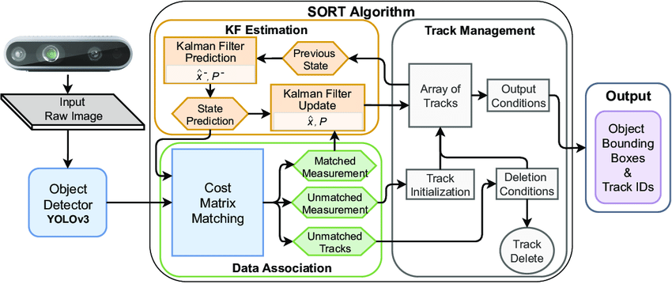

# Multi-Object-Detection-and-Tracking

## **Introduction**  
This project focuses on **multi-object detection and tracking** using the **MOT17 dataset**, a benchmark dataset for pedestrian tracking in real-world urban environments. 
The goal is to train an object detection model based on **YOLO (You Only Look Once)** to detect and track pedestrians across multiple video sequences.  

The MOT17 dataset presents various challenges, including **crowded scenes, occlusions, motion blur, and different lighting conditions**. 
By leveraging state-of-the-art deep learning techniques, we aim to improve object detection accuracy and tracking performance using **YOLO and MOTA (Multiple Object Tracking Accuracy) metrics**.  

### **Project Objectives**  
✔ Train an object detection model on MOT17 dataset annotations.  
✔ Convert the dataset into a YOLO-friendly format for training.  
✔ Evaluate tracking performance using MOTA and related metrics.  
---

## **Dataset: MOT17 Overview**  
The **MOT17 dataset** is a benchmark dataset used for **multi-object tracking (MOT)** and **object detection** in real-world surveillance environments. 
It includes **21 sequences in the training set and 21 sequences in the test set**, each containing labeled pedestrian annotations for evaluating tracking algorithms.  

### **Dataset Structure**  
The dataset is structured as follows:
```
/MOT17
├── train/
│ ├── MOT17-01-DPM/
│ ├── MOT17-02-DPM/
│ ├── MOT17-03-FRCNN/
│ ├── MOT17-04-SDP/
│ ├── ... (21 sequences)
├── test/
│ ├── MOT17-01-DPM/
│ ├── MOT17-02-DPM/
│ ├── MOT17-03-FRCNN/
│ ├── MOT17-04-SDP/
│ ├── ... (21 sequences)
```
Each sequence contains:
```
/MOT17-XX-[Detector]/
├── img1/ # Image frames
├── gt/ # Ground truth annotations
│ ├── gt.txt # Bounding box labels
├── det/ # Precomputed detections
├── seqinfo.ini # Metadata (FPS, frame count, etc.)

```
### **Number of Images & Sequences**  
- **Total Sequences**: **21 for training + 21 for testing = 42 total sequences**  
- **Images per Sequence**: Varies from **600 to over 1,500 frames per sequence**  
- **Total Frames**: **~30,000+ frames** across all sequences  

### **Ground Truth (`gt.txt`) Format**  
Each **ground truth file** follows the standard MOT format:  
frame_id, object_id, x, y, width, height, conf, class, visibility

- `frame_id`: The frame number in the sequence  
- `object_id`: A unique ID assigned to each pedestrian  
- `x, y, width, height`: Bounding box coordinates  
- `conf`: Confidence score (always `1` for ground truth)  
- `class`: Object class (typically `1` for pedestrian)  
- `visibility`: A value between `0-1`, indicating how much of the object is visible  

### **Detector Variants in the Dataset**  
Each sequence appears **three times**, processed by different object detectors:  
- **DPM (Deformable Part Model)**  
- **FRCNN (Faster R-CNN)**  
- **SDP (Scale-dependent Pooling)**  

For example, **MOT17-02** has three versions:  
- `MOT17-02-DPM/`  
- `MOT17-02-FRCNN/`  
- `MOT17-02-SDP/`  

These provide multiple detection inputs to evaluate how different detectors affect tracking performance.  

### **Challenges in MOT17 Dataset**  
- **Crowded pedestrian areas** (e.g., urban streets, train stations)  
- **Severe occlusions** where people overlap significantly  
- **Motion blur and lighting variations**  
- **Camera movement in some sequences**  

---

## **Exploratory Data Analysis (EDA)**  
In this section, we analyze the dataset to extract key insights:  
- **Bounding box statistics** (size distribution, aspect ratios)  
- **Object density per frame** (how many people are present in each frame)  
- **Visibility analysis** (percentage of occluded objects)  
---

## **Model**  
This project combines **YOLOv5** for object detection and **SORT (Simple Online and Realtime Tracker)** for multi-object tracking.  

- **YOLOv5** is used to detect objects (pedestrians) in each frame of a video sequence.
- **SORT** is then applied to assign unique IDs to detected objects and track their movement across frames.  
- This combination ensures **real-time** tracking performance while maintaining **accuracy and efficiency**.

### Object Detection Model: YOLOv5  
This project utilizes **YOLOv5**, a state-of-the-art real-time object detection model. **YOLO (You Only Look Once)** is a deep-learning-based object detection framework that divides images into grids and predicts bounding boxes and class probabilities.

#### Advantages of YOLO
- **Fast inference speed** (~60 FPS on GPU).
- **High accuracy** in real-time object detection.
- **Anchor-free design**, making it more efficient for object tracking.

#### Training YOLOv5
YOLOv5 was trained on the **MOT17 dataset**, detecting and classifying objects (mainly pedestrians). The **training process** involved:
- **Data preprocessing**: Converting annotations to YOLO format.
- **Custom YAML configuration** specifying dataset paths and class names.
- **Training using pre-trained weights (`yolov5s.pt`)**.

### Tracking Algorithm: SORT
For multi-object tracking, we use SORT (Simple Online and Realtime Tracker), a fast and efficient tracking algorithm that works with bounding box detections.

#### Architecture of the SORT algorithm


[^1]

#### How SORT Works:
- **Detection Input:** Receives YOLOv5 detections (bounding boxes).
- **Kalman Filter Prediction:** Predicts the next position of each tracked object.
- **Hungarian Algorithm for Data Association:** Matches new detections with existing tracks.
- **Track Management:** Assigns new IDs to objects and removes lost tracks.

#### Advantages of SORT:
- Lightweight and real-time (runs at high FPS).
- No need for deep learning-based re-identification.
- Effective for short-term tracking tasks.

## Evaluation metric 
### MOTA (Multiple Object Tracking Accuracy)
**MOTA** is a popular evaluation metric used to assess the performance of multi-object tracking systems.
It quantifies the accuracy of tracking by considering different types of errors, including false positives (FP), false negatives (FN), and identity switches (ID switch).

- **False Positives:** These occur when the tracker falsely detects an object where there is none.
- **False Negatives:** These occur when the tracker misses detecting an actual object.
- **Identity Switches:** These happen when the tracker switches the identities of objects, leading to confusion in tracking.

#### **Formula**:
MOTA is calculated using the following formula:

$\text{MOTA} = 1 - \frac{FP + FN + IDS}{GT}$
Where:
- \( FP \): False Positives (number of detections that do not correspond to any ground truth object)
- \( FN \): False Negatives (number of ground truth objects that were not detected)
- \( IDS \): Identity Switches (number of times a tracked object switches its identity during tracking)
- \( GT \): Total number of ground truth objects (total number of objects in the dataset)

In this project,we recieved a MOTA value of 0.56.

## Future improvements 
- **Integrating DeepSORT for Better Identity Association**
While SORT is a fast and efficient tracker, it may struggle with identity switches and occlusions in complex scenes. Integrating DeepSORT, which uses deep learning for improved appearance feature extraction, could help maintain more accurate object identities across frames.
- **Switching to a Constant Acceleration Model for Kalman Filter**
Currently, the Kalman filter in the project uses a constant velocity model to track the objects. However, in real-world scenarios, objects often undergo acceleration or deceleration. To improve the accuracy of tracking in such cases, we can switch to a constant acceleration model.
In the constant acceleration model, the state vector is expanded to include position, velocity, and acceleration. This allows the Kalman filter to better predict the motion of objects that experience changes in speed, rather than assuming constant velocity. The state transition matrix and the process model will be updated to incorporate acceleration, providing more accurate predictions for object tracking in dynamic environments.


## References
[^1]: [Source: ResearchGate](https://www.researchgate.net/figure/Overview-of-the-object-tracking-SORT-algorithm_fig2_358134782)


